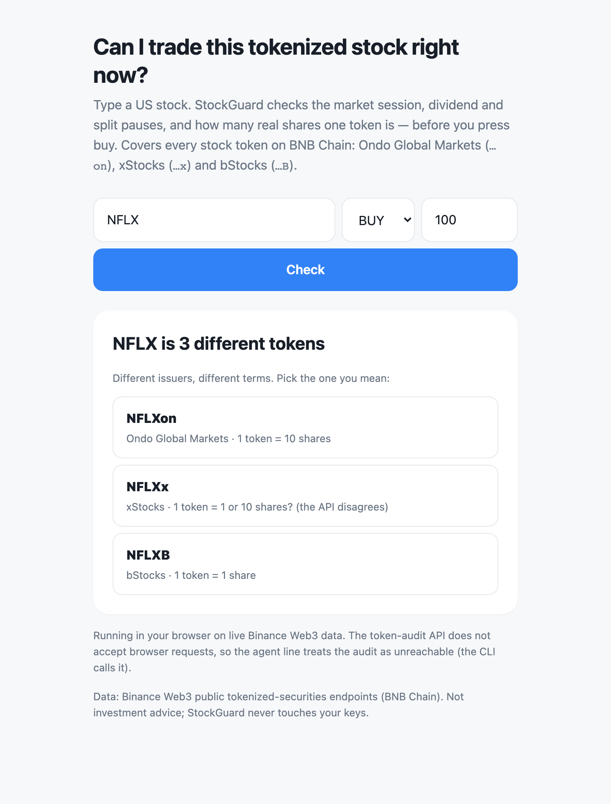
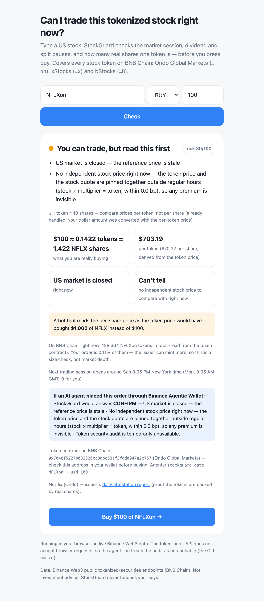
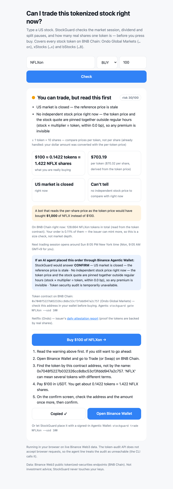

# StockGuard

**"Can I trade this tokenized stock right now — and what am I really buying?"**

A pre-trade safety layer for tokenized US stocks on BNB Chain, for people and for AI agents. It sits **in front of Binance Agentic Wallet**: before an agent calls `baw market-order swap` or `baw limit-order`, StockGuard answers `PROCEED`, `CONFIRM`, `ASK` or `REFUSE`, with plain-English reasons and the exact wallet commands in the right units. `stockguard trade` is built to drive the whole order with a signed-in wallet: preflight, gate, a re-check of the wallet's own quote, the user's typed yes, the swap, and polling until the order finishes or fails. Its flags are checked against the real `baw` 1.10.0 CLI and it handles the CLI's real not-signed-in answers. The order flow itself is tested against a fake `baw` built from the skill's reference responses; a live signed run is still to come (see the end of this page).

Why it is needed: the Agentic Wallet skill requires a token security audit before every swap, and that audit returned **no data for 663 of the 675 stock tokens** on BNB Chain (all 458 Ondo, all 130 xStocks, 75 of 87 bStocks — F14). The stock-specific risks it can't see are the ones StockGuard checks.

Covers all three issuers on BNB Chain, read through the Binance Web3 RWA Data API and the Token Security Audit API: **Ondo Global Markets** (`…on`, 458 tokens), **xStocks** (`…x`, 130) and **bStocks** (`…B`, 87).

## What already exists, and what it can't see

| Tool | What it checks | US session · dividend/split pause · token-to-share multiplier |
|---|---|---|
| [Blockaid](https://www.blockaid.io/) (MetaMask's security alerts) | simulates a transaction before you sign; scam, drainer and malicious-token warnings | not on its public site (developer docs need a login) |
| [GoPlus Security](https://docs.gopluslabs.io/reference/response-details.md) | token contract API: honeypot, buy/sell tax, mintable, owner powers, `transfer_pausable` | no — not in its field list (`transfer_pausable` is a contract power, not an issuer's dividend pause) |
| [Binance Web3 `query-token-audit`](https://github.com/binance/binance-skills-hub/tree/main/skills/binance-web3/query-token-audit) — the audit the Agentic Wallet runs before every swap | contract and trade risk level, honeypot, tax | no such fields; **no data for 663 of 675 stock tokens** |
| [Binance Web3 `binance-tokenized-securities-info`](https://github.com/binance/binance-skills-hub/tree/main/skills/binance-web3/binance-tokenized-securities-info) | read-only data: market status, asset pauses, multiplier, price | yes, as raw data with no verdict; documented for Ondo only, and the wallet's pre-trade check doesn't call it |
| [Robinhood](https://robinhood.com/us/en/support/articles/trading-halts/) and other brokers | market hours and exchange halts | yes for hours and halts; no multiplier (one share is one share) |

**What only StockGuard does:** it turns that market data into a verdict (`PROCEED` / `CONFIRM` / `ASK` / `REFUSE`) for all three issuers, in front of the wallet's swap, and catches where the data contradicts itself (two multipliers for one token, a "stock price" pinned to the token price, a last trade days old). Sources checked 2026-10-10: official sites and docs, GitHub, news, store listings and Reddit.

## Judges: run it in one minute

```bash
git clone https://github.com/Ryugi62/stockguard && cd stockguard
python3 demo.py            # no install, no API key, no wallet, no network
python3 demo.py --live     # the same walkthrough on live public data
```

`demo.py` replays **recorded real responses** (`fixtures/recorded/demo-2026-10-04.json`, captured 2026-10-04 04:54 UTC by `scripts/record_demo_fixtures.py`). It runs in under a second. One token in it, `SPLITDEMOon`, is synthetic and labelled as such everywhere: it shows the stock-split `REFUSE` path, which can't be observed on a weekend. Python ≥3.9, standard library only.

What the demo shows:
1. "NFLX" is three different tokens: NFLXon is 10 Netflix shares per token, NFLXB is 1, and NFLXx is 1 or 10 depending on which endpoint you ask. StockGuard asks which one you mean instead of guessing. It also shows the price per share: $67.06, $71.30 and $67.59 for the same share in the recording. NFLXx's $71.30 is its last trade, from 2026-09-28 (F16); live, StockGuard leaves it out of the comparison.
2. `check NFLXon --usd 1000` → `WARN`: the US market is closed and the quoted stock price is derived from the token price itself.
3. An agent buying NFLXx → `REFUSE` on real data: the API gives two multipliers, and its supply (10,000) disagrees with the chain (100,000). No wallet command is emitted.
4. KLACon → `CONFIRM` with the `baw` quote and swap commands. The wallet skill's mandatory token audit has no data for this token (or 662 others), so the user has to acknowledge. StockGuard puts its stock warnings into that same confirmation.
5. "Sell when Netflix hits $75" → `baw limit-order sell --triggerPrice 750.00`. The trigger is per token, and NFLXon is 10 shares, so a $75 trigger would fire immediately. The gate also flags any trigger that is already met. The skill quotes an `Ondo-related tokens cannot be traded` error for limit orders; if the wallet rejects one, `trade` stops and never falls back to a market order.
6. A token paused for a stock split → `REFUSE` (synthetic scenario token).
7. The wallet's own `quotaLeft` is $250 → the order is cut from $500 to $250.
8. A wallet quote for 10× the approved SELL (a token/share mix-up, F17; synthetic quote) → `REFUSE` before any swap.

Every command also takes `--offline`, and `STOCKGUARD_OFFLINE=1` does the same.

**Live, nothing to install: https://ryugi62.github.io/stockguard/** — the same Python package running in your browser (Pyodide) on the live public endpoints; first load takes a few seconds (rebuild: `python3 scripts/build_site.py --out site`). The token audit can't be called from a browser (F18), so that page shows it as unreachable; the CLI calls it.

Three clicks from a question to the wallet: **Check** → pick which NFLX you mean → **Buy $100 of NFLXon** (the steps for exactly that order, the contract address to copy, and a link to Binance Wallet). A `BLOCK` verdict has no buy button.

<p>



</p>

## Five ways to use it

| Surface | For | Command (after `pip install -e .`, or `PYTHONPATH=src python3 -m stockguard …`) |
|---|---|---|
| Agentic Wallet gate | AI agents, before any swap or limit order | `stockguard gate KLACon --usd 1000 [--slippage 1] [--trigger-share-price 75 --side SELL] [--wallet-settings settings.json]` |
| Guarded trade | a person with a signed-in Agentic Wallet | `stockguard trade KLACon --usd 5` (runs `baw`; the wallet signs under its own limits) |
| MCP tools `guard_agentic_wallet_swap`, `check_tokenized_stock_trade` | LLM agents | `stockguard mcp` (stdio) |
| Web page | non-crypto users ("Why can't I buy NFLX right now?") | `stockguard serve` → http://127.0.0.1:8787 |
| CLI / library | bots, scripts | `stockguard check NFLXon --usd 1000` · `stockguard compare NFLX` (per-issuer terms and per-share prices) |

Exit codes, so scripts and agents can branch without parsing JSON: `gate` 0 PROCEED · 10 CONFIRM · 11 ASK · 12 REFUSE; `check` 0 ALLOW · 10 WARN · 12 BLOCK; `trade` 0 finished or limit placed · 3 still processing · 1 stopped before or at the wallet. 1 and 2 also mean error / bad arguments.

## The Agentic Wallet gate (`src/stockguard/domain/wallet_gate.py`)

StockGuard never signs. `gate` prints the wallet commands; `trade` runs them through `baw` only after the gate and the user's typed yes, so the wallet still signs under its own limits. The verdict uses the same words as the wallet's own security settings (`references/wallet-setting.md`: `abnormalTxnHandling` = `AutoReject` | `NeedConfirmation`, `quotaLeft`, `tradeAllTokens`). It is an analogy: the wallet itself never sees StockGuard's verdict.

| StockGuard | Gate | Analogous wallet setting |
|---|---|---|
| `BLOCK` (halt, dividend/split pause, no token price, unverifiable token terms) | `REFUSE`, no command | `AutoReject` |
| `WARN` with risk ≥ 40 (earnings, unclear multiplier, big premium …) | `CONFIRM`: show the reasons, wait for an explicit yes. `trade --yes` is honoured only for a `PROCEED` order with risk 0 and an audit | `NeedConfirmation` |
| `WARN` with risk < 40 (market closed, stale reference) | `PROCEED`, with the reasons as heads-up notes to show the user, so users don't learn to click through | — |
| `ALLOW` | `PROCEED` (the skill's normal per-trade confirmation still applies) | — |
| BUY token audit unavailable or skipped (`--no-audit`) / riskLevel 2–3 or tax 5–10% / riskLevel ≥ 4 or tax > 10% | `CONFIRM` (acknowledge; the stock warnings go into the same confirmation) / `CONFIRM` / `REFUSE` (the skill's table: 4 = "Avoid trading", 5 = "Block"). SELL into USDT: no audit (trusted target) | — |
| limit trigger already met at the current token price | `CONFIRM` ("would fire immediately") | — |
| order > wallet `quotaLeft` | `CONFIRM` with the order cut (rounded down) to `quotaLeft`; under $1 left → `REFUSE` | daily limit |
| the wallet's quote is > 1% / > 5% worse than the token price (`trade`) | `CONFIRM` / stop before the swap. Without `--slippage`, the swap is capped at 1% (not "auto", in `gate` too), and if the user took over 30 s to confirm, it re-quotes first | — |

Each rule follows the official skill text (`binance-skills-hub` commit `9960c675`, `skills/binance-web3/binance-agentic-wallet` v1.12.0 and `query-token-audit`). Every quote below is checked word for word against that commit by `scripts/verify_skill_quotes.py` (14 of 14 found, `docs/skill-quotes-check.md`):

| Skill text | What the gate does |
|---|---|
| "The same ticker often exists under more than one provider … **do not default to Ondo. Ask the user which provider they mean**" (SKILL.md) | bare ticker with several issuers → `ASK` + the choices with their multipliers |
| "Before `market-order swap`, `limit-order buy`, or `limit-order sell`, complete the pre-check in security.md" (SKILL.md) → token audit; "Security audit data is not available for this token on this chain." / "Token security audit is temporarily unavailable." → "Require explicit user acknowledgment" (references/security.md) | calls the public audit API for every BUY (the target is the stock token; a SELL's target is a trusted stablecoin, so step 1 skips it). Unavailable or unreachable → `CONFIRM` with those exact words; `riskLevel` ≥ 4 or tax > 10% → `REFUSE`; the skill's "LOW risk does NOT mean safe" disclaimer is shown verbatim (query-token-audit) |
| "**Fail-closed**: If the security check API is unreachable, inform the user and require acknowledgment" (SKILL.md) | applied to the audit as above. StockGuard applies the same principle to its own market data: if the list or price call fails → `REFUSE` |
| "**No address hallucination**: Never fabricate a contract address" (SKILL.md) | contract not in the RWA token list → `REFUSE`; the `toToken` address only ever comes from the list |
| "Confirm with the user each time before any state-changing command" (SKILL.md) | `CONFIRM` can't be skipped |
| `baw market-order quote/swap --fromTokenQty --fromToken --toToken --binanceChainId [--slippage] … --json` (references/market-order.md) | prints exactly these commands with full contract addresses; stablecoin amounts to the cent, SELL token amounts rounded down, BNB amounts converted at the given BNB price |
| `limit-order buy/sell --triggerPrice` = "USD price that activates the order"; pay/receive "only USDT, USDC, and Native Token" (references/limit-order.md); "never silently downgrade to immediate execution" (SKILL.md step 7) | converts a per-share target into the per-token trigger with 6 significant digits (refuses when the multiplier is disputed), only allows USDT/USDC/BNB, and if the wallet rejects the limit order, `trade` stops and never falls back to a market order |
| "Report the error exactly as returned" (SKILL.md) | `trade` passes `baw` errors through word for word; a CLI timeout says the order may have been submitted |
| "For trades without explicit slippage, disclose the default ("auto")" (SKILL.md) | `--slippage` is passed through; without it, `gate` and `trade` both cap at 1% (not "auto") and say so |
| "an orderId is NOT a completed swap — poll to a terminal state" (references/market-order.md) | the third command is the `market-order list --orderId` poll until `FINISHED` / `FAILED` |
| `wallet settings` → `quotaLeft`, `tradeAllTokens`, `quotaDate` (references/wallet-setting.md) | `--wallet-settings` takes that JSON as is (`trade` reads it live); flags settings from another day |
| `wallet status` → `CONNECTED`, `cli-check --required-version 1.10.0` (references/wallet-view.md, preflight.md) | `trade` stops at preflight unless the wallet is connected and the CLI is new enough; BUY checks the pay-token balance and SELL the token balance first; an order still PENDING after polling is reported as "still processing", never as done |
| `baw` 1.10.0 itself (installed on 2026-10-04 for these fixtures, not signed in; not installed on the machine used for `docs/agent-run-2026-10-07.md`) | flags checked against the real `--help` (`fixtures/baw/cli-1.10.0-help.txt`); real `UNCONNECTED` / `NOT_LOGGED_IN` responses are test fixtures |
| `baw` 1.10.0's own code (`dist/index.js` of the published package, read, not run — F17): for tokenized stocks a market-order SELL amount, a BUY quote's `toCoinAmount` and `wallet balance` are in **shares**; limit orders are sent in token units | a market SELL's `--fromTokenQty` is tokens × the multiplier baw uses (its `scaleui/list`, equal to `list/ai` for all 675 tokens); the quote re-check and the SELL balance check convert back to tokens (with `--json`, baw drops `rawBalance`, so the share balance is divided by the multiplier); a quote for a different amount, or more than 25% *better* than the market (a unit error), stops the order; limit orders stay in token units |
| the wallet's quote, when an agent runs the commands itself | `gate --quote-json quote.json` re-gates on the saved `baw market-order quote --json` output: > 1% worse → `CONFIRM`, > 5% → `REFUSE` with no commands (the same check `trade` runs) |

## What it checks (domain rules, `src/stockguard/domain/guard.py`)

- **Market-wide halt**, **asset paused** (cash/stock dividend, split, merger, acquisition, spinoff, maintenance), or **no token price** → `BLOCK`
- **Earnings-limited** asset → `WARN`
- **US market closed**, or pre-market / after-hours / overnight / 24-7 off-hours trading → `WARN`
- **Multiplier ≠ 1** → `WARN` with the real share count ("1 token = 10 shares"). If you size the order in dollars, it becomes a note instead, because the dollar amount already uses the per-token price.
- **The API contradicts itself on the multiplier** (the token list and the price feed disagree by more than 1%) → `WARN`, with no premium from either value and the share count taken from the price ratio. Together with an API-vs-chain supply mismatch → `BLOCK` ("token terms can't be verified")
- **No market session reported** by the issuer (all xStocks/bStocks on weekends), or the market-wide session is pause / pre / post / overnight → `BLOCK` for a halt, `WARN` otherwise
- **No multiplier** in the payload → `WARN` (1 is only an assumption)
- **Premium/discount** against the independent stock price → `WARN` above 1%; more than 25% either way → `BLOCK` as a data error (live MRVLx −88%, GMEx +845%)
- **No independent stock price** (it is just token price ÷ multiplier) → `WARN` ("any premium is invisible")
- **Large order**: more than 1% of all tokens on BNB Chain (`totalSupply()` over public BSC RPC) → note. Supply is not liquidity.
- **Risk score 0–100**, so warnings can be ranked: halt/pause/no price/unverifiable terms/price more than 25% off 100 · earnings 40 · multiplier conflict 40 · missing multiplier 30 · last on-chain trade over 3 days ago 30 (over 7 days: 100) · multiplier up to 30 · premium up to 40 (1 point per 0.1% beyond the threshold) · market closed 15 · no independent price 15 · outside regular hours 10 · no session reported 10.

## What we found on live data

Scans of every BSC stock token: 2026-10-03 (Ondo, 458 tokens, 7.4 s) and 2026-10-04 (all three issuers, 675 tokens, 13.8 s, 0 request errors).

How the two headline numbers are counted:
- **663 of 675**: stock tokens in the RWA list for which the Token Security Audit returned `hasResult: false` or `isSupported: false` (all three issuers, 2026-10-04, `data/audit-all-20261004.jsonl`).
- **432 of 458**: Ondo tokens whose weekend `stockInfo.price × multiplier` equalled `tokenInfo.price` to 1e-6 (2026-10-03 rescan, `data/scan-20261003-weekend.jsonl`).
`python3 scripts/check_numbers.py` recomputes both from the raw files and fails if this page, the docs, the skill or the web page say anything else (it also checks the test count below).

- 432 of 458 Ondo tokens reported a weekend "stock price" exactly equal to the token price ÷ multiplier: the two are pinned together, so premium checks read 0%. The stock quote itself is one feed shared across issuers (identical for 85 of 86 multi-issuer tickers, 2026-10-07); StockGuard lends it to bStocks, which carry none.
- xStocks and bStocks reported `marketStatus: null` and `reasonCode: TRADING` for all 217 tokens on a Sunday. At the same moment Ondo reported 426 `closed`, 31 `offhours` and 1 `regular` (USDY).
- For 39 of 130 xStocks, the token list and the price feed give different multipliers: NFLXx 1 vs 10, CRWDx 1 vs 4, TQQQx 1 vs 2.01, AZNx 1 vs 0.51. The supply is off by the same factor: NFLXx totalSupply on chain 100,000 vs API 10,000. 77 of 130 xStocks had no token price.
- NFLXx's token price came back as the same 38-digit string on Sunday 2026-10-04 and Wednesday 2026-10-07, while the stock moved from $67.06 to $69.16. Nothing in the payload marks it stale (F16). The BSC price feed's NFLXx multiplier (10) equals the Solana entry's, not the BSC entry's (1).
- The token security audit that the Agentic Wallet skill requires before every swap returned `hasResult: false, isSupported: false` for 663 of 675 stock tokens: all 458 Ondo, all 130 xStocks, 75 of 87 bStocks. The 12 bStocks with data were all `riskLevel 0`. USDT came back `riskLevel 3`. Raw: `data/audit-all-20261004.jsonl` (`scripts/audit_sample.py --n 0`).
- 38 tickers exist under all three issuers, with different terms. NFLX is 10 shares per token on Ondo and 1 on bStocks. CRWD is 4 and 1.
- Multiplier exposure (simple arithmetic on the real multipliers, not an observed agent): sizing "$1,000" by the per-share price instead of the per-token price buys **$10,026 of KLAC** or **$66.67 of ENLV** (`stockguard replay data/scan-20261003-weekend.jsonl`). On the `baw` market-order path a BUY is sized in USDT, so this bites in limit-order triggers and SELL quantities. The gate converts both.

Seven of these findings in one command, on the live endpoints: `python3 scripts/reproduce_findings.py` (about 1 s, no key; `--offline` replays the recorded responses). The raw notebook with reproduction commands is `docs/dx-findings.md`.

## Use it from an agent

As a skill: `skills/stockguard-pretrade/SKILL.md` tells an agent that already uses `binance-agentic-wallet` to run the gate instead of building the swap command itself, and what to do for each action. A real run of an AI agent following it (ASK → the user picks → CONFIRM → stops at the wallet, which isn't signed in here): `docs/agent-run-2026-10-07.md`.

As MCP:

```json
{ "mcpServers": { "stockguard": { "command": "python3", "args": ["-m", "stockguard", "mcp"],
  "env": { "PYTHONPATH": "/path/to/stockguard/src" } } } }
```
- `guard_agentic_wallet_swap({ticker, usd_amount, side?, pay_with?, slippage?, trigger_share_price?, pay_price?, wallet_settings?})` → action + reasons + audit + `baw_commands`
- `check_tokenized_stock_trade({ticker, side?, token_qty? | usd_amount?})` → `ALLOW | WARN | BLOCK` + reasons + share count + issuer attestation link

## Not in this build yet

A recorded live mainnet trade, and a Transaction API dry-run (that API needs a developer-portal key). `stockguard trade` is tested against a fake `baw` that follows the share/token semantics read from the published `baw` 1.10.0 code (F17; `tests/test_trade.py`: market path, SELL in shares, limit placed, limit rejected, balance checks, re-quote, poll timeout) and against real unsigned `baw` output (`tests/test_baw_real_shapes.py`). Running it for real needs a signed-in Agentic Wallet with a few dollars in it. The quote and order response fields (`fromCoinAmount`, `orderId`, `status`, `txHash`) come from the skill's reference docs and the CLI code until that run.

## Architecture

`domain/` (pure rules: guard, wallet gate, quote check, issuers) ← `application/` (check, compare, scan, replay, gate_swap, guarded trade over a `WalletPort`) ← `adapters/` (Binance public RWA HTTP, token audit, BSC RPC, recorded/offline client, Agentic Wallet `baw` adapter, web, MCP stdio) ← `infrastructure/` (CLI, demo). The domain imports nothing from the other layers. Spec: `SPEC.md`.

## Tests

```
python3 -m pytest -q      # 179 tests, offline (fixtures are real recorded responses; `baw` is faked or recorded)
```

## Data source

Binance Web3 public tokenized-securities endpoints (`binance-skills-hub/binance-tokenized-securities-info`; list `type=1|2|3` from `binance-agentic-wallet`). Read-only. This is not investment advice.
